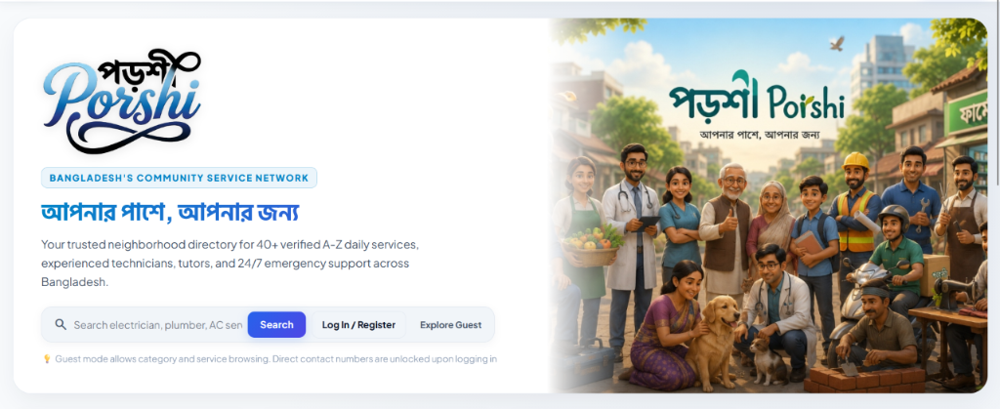

<div align="center">

# 🏘️ Porshi (পড়শী) — Community Services & Mutual-Aid Network

### আপনার পাশে, আপনার জন্য · Bangladesh's Verified Neighborhood Services Directory

<br/>

[](https://developer.mozilla.org/en-US/docs/Web/JavaScript)
[](https://nodejs.org/)
[](https://expressjs.com/)
[](https://www.mongodb.com/)
[](https://developer.mozilla.org/en-US/docs/Web/CSS)
[](LICENSE)

<br/>

> **A full-stack, hyper-local neighborhood directory and civic mutual-aid web platform designed to connect Bangladeshi citizens directly with 40+ categories of verified doorstep technicians, healthcare practitioners, tutors, and 24/7 emergency hotlines without intermediaries or broker commissions.**

<br/>

<p align="center">
  
</p>

<br/>

[🚀 Quick Start](#-quick-start--installation) · [✨ Core Modules](#-core-modules--features) · [🏗️ Architecture](#%EF%B8%8F-system-architecture) · [🗄️ Database Schemas](#%EF%B8%8F-database-schemas-mongodb) · [🔌 API Reference](#-api-endpoints-reference) · [📄 License](#-license)

</div>

---

## 📖 Overview

In urban and semi-urban Bangladesh, finding reliable and verified household service specialists (electricians, plumbers, AC technicians, appliance repairers, home tutors, ambulance drivers, or local health workers) often relies on fragmented word-of-mouth or exploitative agency middlemen.

**Porshi (পড়শী)** is an open-source, community-driven civic platform engineered to solve this challenge. It provides:
- **Direct, Zero-Commission Connections**: Consumers contact local verified specialists directly via phone, WhatsApp, or instant appointment scheduling.
- **National ID (NID) & Community Trust Verification**: Dual-tier verification distinguishes certified professional technicians from community-recommended neighbors.
- **Guest-Safe Data Architecture**: Public directory browsing is unrestricted, while direct contact numbers and active community interactions remain safeguarded behind verified authentication.
- **24/7 Life Support & Emergency Hub**: Instant 1-tap dispatch for ambulances, emergency oxygen, 24/7 pharmacies, LPG gas delivery, and toll-free national emergency lines (999, 333, 109, 16263).

---

## ✨ Core Modules & Features

### 1. 🔍 Comprehensive 40+ A-Z Service Directory
- **Interactive Geospatial Filters**: Multi-range radius selector (1 km to 25 km), category groupings (*Home Services, Repairs & Tech, Health & Care, Education, Transportation, Lifestyle & Events*), rating thresholds (★ 3.0+ / 4.0+), and real-time pricing range sliders.
- **Radar Service Map**: Live radial proximity scanner visualizing neighborhood technicians around the user's active geographic coordinate.
- **Instant Keyword Search & Popular Chips**: Real-time filtering matching specialist names, sub-skills, service descriptions, and trade tags.

### 2. ⚡ 24/7 Instant Emergency Hub
- Direct rapid-response hotlines for **Ambulance ICU & Oxygen**, **24/7 Pharmacy Delivery**, **15-Minute LPG Gas Cylinders**, **Emergency Electrician (Short Circuit / DB Board Fix)**, **Plumber / Pipe Burst Fix**, and **Local Palli Chikitshok & First Aid**.
- Integrated toll-free Bangladesh Government emergency gateways: `999` (Police/Fire/Ambulance), `333` (Citizen Helpdesk), `109` (Women & Child Protection), and `16263` (Shastho Batayan Health Hotline).

### 3. 💬 Neighborhood Community Forum & Discussion Board
- **Geographic Scope Switching**: Filter discussions strictly within **My Area** (e.g., *Dhanmondi, Mirpur, Uttara*) or broadcast across **All Bangladesh**.
- **Categorized Threads**: *Help Needed (জরুরি সাহায্য)*, *Recommendations (পরামর্শ / কারিগরের খোঁজ)*, *Neighborhood Safety (নিরাপত্তা)*, and *Local Events (এলাকার ইভেন্ট)*.
- **Citizen Engagement**: Real-time thread upvotes, collapsible multi-turn reply chains, and neighbor advice timestamps.

### 4. 👥 Dual Role Architecture & Dedicated Dashboards
- **Citizen Consumer Dashboard**: Track active appointment bookings, status indicators (*Pending, Confirmed, Completed*), earned citizen trust points, and post-service worker review & star rating system.
- **Service Pro Specialist Portal**: NID-verified technician control panel to accept/decline incoming service requests, inspect order addresses, and monitor average rating analytics.

### 5. 🌐 Full Internationalization (i18n) & Modern Theming
- **Instant Bilingual Switching**: Complete real-time locale toggle between **English (EN)** and **বাংলা (বাং)** with zero page reloads.
- **Adaptive Day & Night Mode**: High-contrast dark theme (`#071225` deep navy) and clean light theme (`#f8fafc`) with custom drop-shadow rim filters ensuring calligraphy logo visibility across all viewports.

---

## 🏗️ System Architecture

```
Porshi/
├── backend/
│   ├── config/             # Database connection & environment configuration
│   ├── models/             # MongoDB Mongoose data schemas
│   │   ├── User.js         # Citizen & Service Pro user profiles with bcrypt auth
│   │   ├── Listing.js      # 40+ Service provider directory listings & reviews
│   │   └── Post.js         # Neighborhood community discussion threads & comments
│   ├── routes/             # RESTful API endpoints
│   │   ├── auth.js         # JWT Registration, login, OTP verification & sessions
│   │   ├── listings.js     # CRUD operations for specialists & service ratings
│   │   └── posts.js        # Community posts, scope filters & reply threads
│   └── server.js           # Express application entry point & static asset server
│
├── frontend/
│   ├── assets/             # Brand logos, transparent calligraphy PNGs, hero images
│   ├── bangladesh-data.js  # 8 Divisions, 64 Districts, and Upazila administrative dataset
│   ├── i18n.js             # Bilingual dictionary (English & Bengali translation matrix)
│   ├── index.html          # Semantic HTML5 Single Page Application (SPA)
│   ├── script.js           # Core state machine, DOM rendering, modal managers & radar map
│   └── style.css           # Responsive design system, CSS variables & glassmorphism
│
├── .gitignore              # Standard git exclusion rules
├── LICENSE                 # MIT Open-Source License
├── package.json            # Project dependencies & startup scripts
└── README.md               # Technical documentation & usage guide
```

---

## 🗄️ Database Schemas (MongoDB / Mongoose)

### User Entity (`User.js`)
```javascript
{
  name: { type: String, required: true },
  phone: { type: String, required: true, unique: true },
  password: { type: String, required: true },
  role: { type: String, enum: ['citizen', 'pro'], default: 'citizen' },
  area: { type: String, required: true },
  points: { type: Number, default: 100 },
  hasServiceListing: { type: Boolean, default: false },
  createdAt: { type: Date, default: Date.now }
}
```

### Specialist Listing Entity (`Listing.js`)
```javascript
{
  name: { type: String, required: true },
  workerName: { type: String, required: true },
  category: { type: String, required: true, index: true },
  categoryGroup: { type: String, required: true },
  verificationType: { type: String, enum: ['pro_verified', 'community_added'], default: 'community_added' },
  nidNumber: { type: String, default: null },
  phone: { type: String, required: true },
  whatsapp: { type: String },
  area: { type: String, required: true, index: true },
  priceText: { type: String, default: '৳300 থেকে' },
  priceValue: { type: Number, default: 300 },
  rating: { type: Number, default: 5.0 },
  reviewsCount: { type: Number, default: 0 },
  upvotes: { type: Number, default: 0 },
  reviews: [
    {
      reviewerName: String,
      rating: Number,
      comment: String,
      createdAt: { type: Date, default: Date.now }
    }
  ]
}
```

### Community Discussion Entity (`Post.js`)
```javascript
{
  authorName: { type: String, required: true },
  area: { type: String, required: true, index: true },
  category: { type: String, enum: ['help', 'recommendation', 'security', 'event'], default: 'recommendation' },
  title: { type: String, required: true },
  content: { type: String, required: true },
  upvotes: { type: Number, default: 0 },
  comments: [
    {
      author: String,
      text: String,
      createdAt: { type: Date, default: Date.now }
    }
  ],
  createdAt: { type: Date, default: Date.now }
}
```

---

## 🔌 API Endpoints Reference

### 🔐 Authentication (`/api/auth`)
| Method | Endpoint | Description | Access |
| :--- | :--- | :--- | :--- |
| `POST` | `/api/auth/signup` | Register a new Citizen or Service Specialist account | Public |
| `POST` | `/api/auth/login` | Authenticate user via Mobile Number & Password | Public |
| `GET` | `/api/auth/me` | Fetch authenticated user profile & active booking list | Private |

### 🛠️ Service Specialists Directory (`/api/listings`)
| Method | Endpoint | Description | Access |
| :--- | :--- | :--- | :--- |
| `GET` | `/api/listings` | Query specialists with category, radius, rating & price filters | Public |
| `GET` | `/api/listings/:id` | Fetch detailed worker profile, reviews & masked phone number | Public |
| `POST` | `/api/listings` | Publish new specialist listing (with optional NID verification) | Authenticated |
| `POST` | `/api/listings/:id/review` | Submit star rating (1–5 ★) and feedback comment | Authenticated |
| `POST` | `/api/listings/:id/upvote` | Cast community trust upvote for a specialist | Authenticated |

### 💬 Community Discussion Board (`/api/posts`)
| Method | Endpoint | Description | Access |
| :--- | :--- | :--- | :--- |
| `GET` | `/api/posts` | Retrieve neighborhood feed by area scope (*My Area* vs *All BD*) | Public |
| `POST` | `/api/posts` | Create new discussion topic (*Help, Recommendation, Event*) | Authenticated |
| `POST` | `/api/posts/:id/comment` | Add reply to community discussion thread | Authenticated |
| `POST` | `/api/posts/:id/upvote` | Upvote helpful community advice | Authenticated |

---

## 🚀 Quick Start & Installation

### Prerequisites
- [Node.js](https://nodejs.org/) (v18.x or higher)
- [MongoDB](https://www.mongodb.com/) (Local Community Server or MongoDB Atlas cluster)
- Modern Web Browser (Chrome, Firefox, Safari, Edge)

### 1. Clone the Repository
```bash
git clone https://github.com/Shreyalien/Porshi.git
cd Porshi
```

### 2. Install Dependencies
```bash
npm install
```

### 3. Configure Environment Variables
Create a `.env` file in the root directory:
```env
PORT=5000
MONGO_URI=mongodb://localhost:27017/porshi
JWT_SECRET=porshi_super_secure_jwt_token_key_2026
```

### 4. Start the Application
```bash
# Start backend server & serve frontend SPA
npm start

# Or start in standalone frontend mode:
# Open frontend/index.html directly in any web browser
```

Once running, navigate to **`http://localhost:5000`** in your browser.

---

## ⚡ Default Demo Credentials

For quick evaluation without manual signup:

| Parameter | Value |
| :--- | :--- |
| **Demo Mobile Number** | `01700000000` |
| **Demo Password** | `123456` |
| **Demo OTP Code** | `123456` *(One-Click Autofill Enabled)* |
| **Default Profile** | *Rakib Hasan (Citizen / Consumer)* |
| **Pro Switcher** | *Md. Rahim (Rahim Electric Service)* |

---

## 🛡️ Security & Privacy Architecture

- **Phone Number Safeguarding**: Contact telephone numbers and WhatsApp links are protected from automated scrapers in Guest Mode and only unveiled to verified authenticated users.
- **NID Verification Badge**: Specialists submitting authentic National ID credentials receive a prominent `🛡️ NID Verified` trust badge.
- **Graceful Fallback**: The backend server seamlessly handles offline MongoDB states by operating in standalone client storage mode without crashing.

---

## 👩‍💻 Author & Maintainer

Developed with ❤️ for the citizens of Bangladesh by:

**Shreya**
- GitHub: [@Shreyalien](https://github.com/Shreyalien)
- Project: [Porshi (পড়শী)](https://github.com/Shreyalien/Porshi)

---

## 📄 License

This project is licensed under the **MIT License** — see the [LICENSE](LICENSE) file for details.