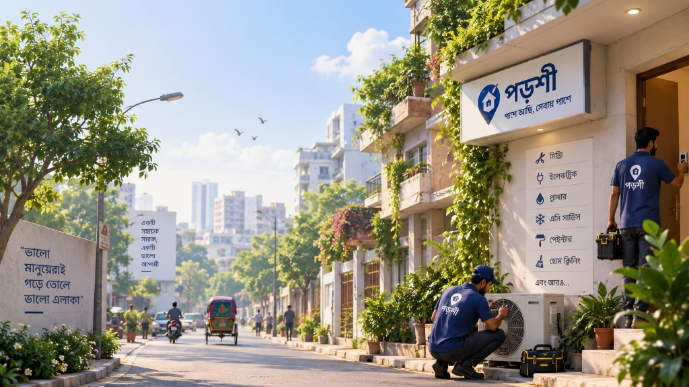

# Porshi (পড়শী) — Bangladesh Neighborhood Services & Community Network

<div align="center">



**আপনার পাশে, আপনার জন্য**
*Your trusted neighborhood directory for 40+ verified A-Z daily services, experienced technicians, tutors, and 24/7 emergency support across Bangladesh.*

[](LICENSE)
[](https://developer.mozilla.org/)
[](https://nodejs.org/)
[](https://github.com/Shreyalien)

</div>

---

## 📖 Overview

**Porshi (পড়শী)** is an open-source, community-centric platform designed for Bangladesh's neighborhoods. It connects citizens with verified local service specialists—such as electricians, plumbers, AC technicians, home tutors, and neighborhood health practitioners—without intermediaries, broker charges, or hidden platform commissions.

Built with a focus on trust, responsiveness, and simplicity, Porshi features full bilingual support (English & Bengali), National ID (NID) verification badges, community recommendations, a real-time service radar map, and a 24/7 emergency assistance hub.

---

## ✨ Key Features

### 1. 🛡️ Multi-Tier Verification & Trust
- **NID Verified Specialists**: National ID verified service providers with genuine customer reviews and experience metrics.
- **Neighbor Recommended**: Community-added listings that help neighbors discover trusted local technicians.
- **Upvote & Rating System**: Direct citizen reviews and trust badges.

### 2. 🔍 Comprehensive 40+ A-Z Directory
- **Multi-Category Coverage**: Electricians, Plumbers, AC Mechanics, Home Cleaning, LPG Gas Delivery, Carpentry, Painting, Appliance Repair, Tutors, and more.
- **Local Healthcare**: Neighborhood village doctors (*Palli Chikitshok* for first aid and blood pressure checks) and veterinary practitioners.
- **Multi-Layered Filtering**: Filter by administrative area (Division, District, Upazila), distance radius (1–25 km), real-time availability ("Available Now"), price range, and star rating.

### 3. ⚡ 24/7 Emergency Assistance Hub
- Instant direct access to emergency ambulance dispatch, 24-hour pharmacies, fast LPG gas delivery, and emergency electricians.
- Integrated national toll-free hotlines: **999** (Emergency Police/Fire/Ambulance), **333** (Citizen Services), **109** (Women & Child Protection), and **16263** (Shastho Batayan).

### 4. 💬 Neighborhood Community Forum
- **Scoped Discussions**: Switch between **📍 My Area** (neighborhood-specific posts) and **🇧🇩 All Bangladesh** (nationwide discussions).
- Categorized discussions: Help Needed, Recommendations, Safety & Alerts, and Local Events.
- Interactive comments thread and upvoting system.

### 5. 👥 Dual Citizen & Service Pro Architecture
- **Pure Citizen Profile (e.g. Rakib Hasan)**: Streamlined single dashboard to manage service appointments, submit ratings, and view inquiry history.
- **Service Pro Dashboard (e.g. Md. Rahim)**: Dual portal allowing specialists to both request services as a citizen and manage client job bookings and incoming orders.

### 6. 🎨 Responsive, Themeable UI & Bilingual Engine
- **Day & Night Mode**: Clean light theme with soft slate accents and deep midnight dark theme.
- **Bilingual Dictionary (i18n)**: Seamless instant switching between English and Bengali (`বাং`).
- **Signature Typography**: Distinctive, handwritten branding style (`Porshi পড়শী`) paired with modern UI design.
- **Privacy-First Guest Mode**: Casual visitors can freely explore categories and service profiles; direct phone numbers and actions are safely locked until authentication.

---

## 📁 Project Structure

```text
Porshi/
├── backend/
│   └── server.js               # Lightweight Node.js / Express backend server
├── frontend/
│   ├── assets/                 # Platform artwork and visual showcase banners
│   ├── bangladesh-data.js      # 64-district administrative cascade dataset
│   ├── i18n.js                 # English & Bengali translation dictionary
│   ├── index.html              # Main single-page web app entry point
│   ├── script.js               # Application logic, routing, and UI interactions
│   └── style.css               # Modern CSS variables, glassmorphism & themes
├── .gitignore
├── LICENSE                     # MIT License
├── package.json
└── README.md
```

---

## 🚀 Quick Start

### Prerequisites
- [Node.js](https://nodejs.org/) (v16.0 or higher recommended)
- Any modern web browser (Chrome, Firefox, Edge, Safari)

### Installation

1. **Clone the repository**:
   ```bash
   git clone https://github.com/Shreyalien/Porshi.git
   cd Porshi
   ```

2. **Install dependencies**:
   ```bash
   npm install
   ```

3. **Start the backend server**:
   ```bash
   npm start
   ```
   *The server will start running at `http://localhost:5000`.*

4. **Open in Browser**:
   - Open `http://localhost:5000` or simply open `frontend/index.html` directly in your browser.

---

## 🛠️ Technology Stack

- **Frontend**: Vanilla JavaScript (ES6+), HTML5, Modern CSS3 (Variables, Grid, Glassmorphism)
- **Icons & Fonts**: Google Fonts (*Plus Jakarta Sans*, *Hind Siliguri*, *Caveat*), Google Material Symbols
- **Avatars**: Illustrated clean SVG avatars (DiceBear collection)
- **Backend**: Node.js, Express.js
- **Animations**: GSAP (GreenSock Animation Platform)

---

## 📄 License

This project is licensed under the **MIT License** — see the [LICENSE](LICENSE) file for details.

---

## 👩‍💻 Author & Attribution

Developed with care for the communities of Bangladesh by **[Shreya](https://github.com/Shreyalien)**.